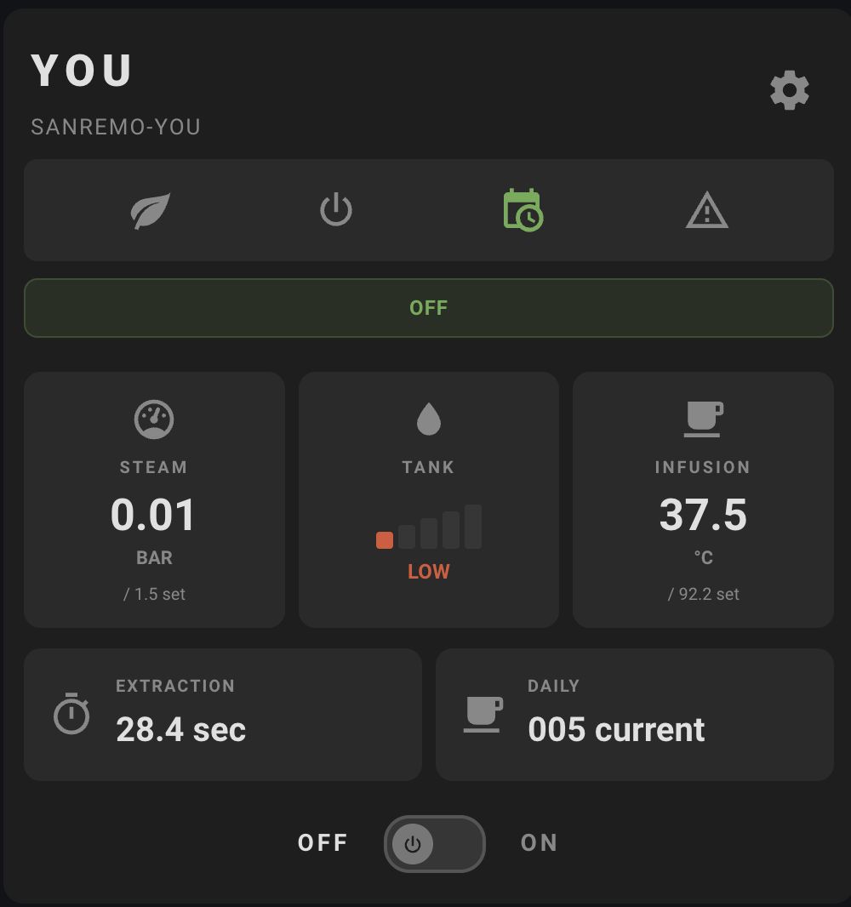
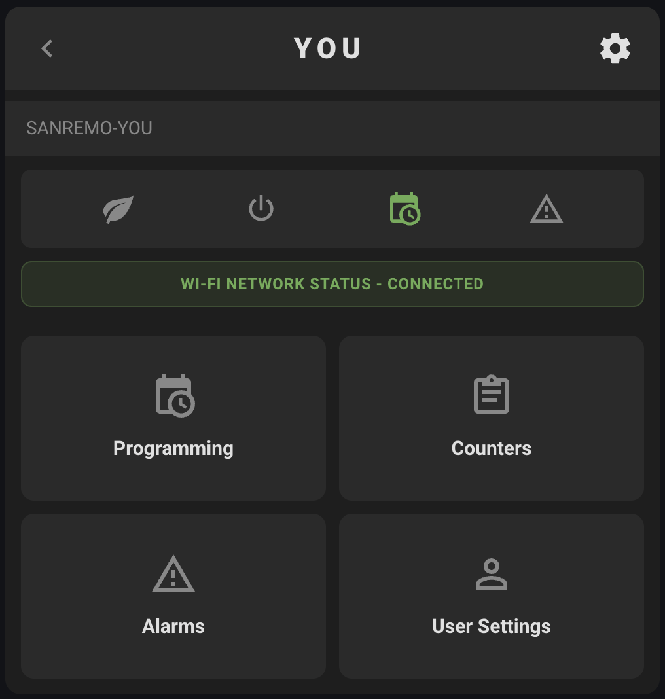

# Sanremo YOU - Home Assistant Integration

[](https://github.com/hacs/integration)

Home Assistant custom integration for the **Sanremo YOU** espresso machine. Provides real-time monitoring and control via the machine's local Wi-Fi interface, including a custom Lovelace dashboard card.

## Custom Dashboard Card

The integration includes a built-in Lovelace card that mirrors the look and feel of the machine's own web interface. The card is **automatically registered** when the integration is installed - just add it to your dashboard.

<p align="center">
  
  
</p>

**Card features:**
- Real-time gauges for steam pressure, water tank level, infusion temperature, extraction time, and daily shot count
- Power on/off toggle
- Settings menu with sub-views for programming (scheduler), counters, alarms, and user settings
- Wi-Fi network status page with signal strength, SSID, IP address, and device information
- Machine status indicators (eco mode, scheduler, warnings)

### Adding the Card

1. In your Home Assistant dashboard, click **Edit Dashboard** > **Add Card**
2. Search for **Sanremo YOU** or scroll to find it in the card picker
3. The card auto-discovers your machine - no manual entity configuration needed

> **Note:** If you use Lovelace in YAML mode, add the resource manually:
> ```yaml
> resources:
>   - url: /sanremo_you/sanremo-you-card.js
>     type: module
> ```

## Features

- **Power control** - Turn the machine on/off from Home Assistant
- **Temperature monitoring** - Coffee boiler, group (infusion), and steam boiler temperatures
- **Pressure monitoring** - Steam boiler pressure and pump pressure
- **Setpoint control** - Adjust coffee boiler temp, group temp, and steam pressure setpoints
- **Shot tracking** - Extraction time and daily shot counter
- **Dose counters** - Lifetime counters for each dose button, continuous, paddle, steam, and tea
- **Scheduler** - Enable/disable the weekly scheduler and configure up to 6 time slots with eco mode
- **Clock sync** - Sync the machine's internal clock to your Home Assistant server time
- **Wi-Fi diagnostics** - SSID, signal strength, IP address, MAC address, and firmware version
- **Status monitoring** - Water tank level, alarms, warnings
- **Custom Lovelace card** - Built-in dashboard card with full machine control and status display
- **Local polling** - No cloud dependency, communicates directly with the machine on your LAN

## Installation

### HACS (Recommended)

1. Open HACS in Home Assistant
2. Click the three dots menu > **Custom repositories**
3. Add this repository URL with category **Integration**
4. Search for "Sanremo YOU" and install
5. Restart Home Assistant
6. Go to **Settings > Devices & Services > Add Integration > Sanremo YOU**
7. Enter your machine's IP address (e.g., `192.168.1.100`)

### Manual

1. Copy `custom_components/sanremo_you/` to your HA `config/custom_components/` directory
2. Restart Home Assistant
3. Add the integration via the UI

## Entities

### Sensors

| Entity | Description | Unit |
|--------|-------------|------|
| Coffee Boiler Temperature | Current coffee boiler temp | °C |
| Group Temperature | Current brew group temp | °C |
| Steam Boiler Pressure | Current steam boiler pressure | bar |
| Pump Pressure | Current pump pressure during extraction | bar |
| Extraction Time | Duration of last/current shot | s |
| Daily Shot Count | Number of shots today | - |
| Machine Status | Current machine state (Off/On/Eco/Deep Sleep) | - |
| Alarms | Active alarm codes | - |
| Warnings | Active warning codes | - |
| Dose 1-3 Counter | Lifetime dose button counters | - |
| Continuous Counter | Lifetime continuous extraction counter | - |
| Paddle Counter | Lifetime paddle counter | - |
| Steam Activation Counter | Lifetime steam activation counter | - |
| Tea Counter | Lifetime tea counter | - |

### Diagnostic Sensors

| Entity | Description | Unit |
|--------|-------------|------|
| WiFi SSID | Connected wireless network name | - |
| WiFi Signal | Wireless signal strength | dBm |
| IP Address | Machine's IP address on the network | - |
| MAC Address | Machine's Wi-Fi MAC address | - |
| Firmware Version | Wi-Fi module firmware version | - |

### Binary Sensors

| Entity | Description |
|--------|-------------|
| Water Tank | Whether the water tank has water |

### Switches

| Entity | Description |
|--------|-------------|
| Power | Turn the machine on/off |
| Scheduler | Enable/disable the weekly scheduler |
| Slot 1-6 Enabled | Enable/disable individual scheduler slots |
| Slot 1-6 Eco Mode | Toggle eco mode for individual scheduler slots |

### Number

| Entity | Description | Range |
|--------|-------------|-------|
| Coffee Boiler Setpoint | Target coffee boiler temperature | 80-100 °C |
| Group Temperature Setpoint | Target brew group temperature | 80-100 °C |
| Steam Pressure Setpoint | Target steam boiler pressure | 0.5-2.0 bar |

### Time

| Entity | Description |
|--------|-------------|
| Slot 1-6 Start Time | Scheduler slot start times |
| Slot 1-6 Stop Time | Scheduler slot stop times |

### Button

| Entity | Description |
|--------|-------------|
| Sync Clock | Sync the machine's clock to Home Assistant server time |

## Protocol

This integration communicates with the Sanremo YOU via its local HTTP API at `/ajax/post` using form-encoded POST requests. The machine's Wi-Fi module (by Net Software srl) exposes this endpoint for both reading status and writing settings. All communication stays on your local network.

## License

MIT
